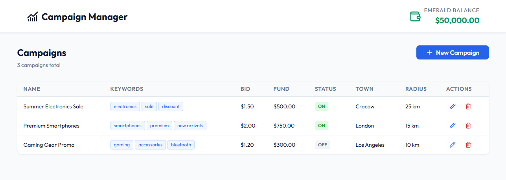

# Campaign Manager

A React application for managing advertising campaigns with full CRUD functionality.

## Preview



## Live Demo

[campaign-manager.vercel.app](https://campaign-manager-xi.vercel.app/)

## Features

- **Create** new advertising campaigns with full validation
- **Edit** existing campaigns with real-time balance updates
- **Delete** campaigns with confirmation dialog
- **Emerald Balance** – campaign funds are deducted/returned automatically
- **Typeahead** keyword suggestions
- **Responsive design** – mobile-first, works on all screen sizes

## Tech Stack

- [React 18](https://react.dev/) – UI framework
- [Vite](https://vitejs.dev/) – build tool
- [SCSS Modules](https://sass-lang.com/) – scoped styling
- [Lucide React](https://lucide.dev/) – icons
- `localStorage` – data persistence (mock backend)

## Getting Started

```bash
# Clone the repository
git clone https://github.com/Avareez/Campaign-Manager.git

# Navigate to project directory
cd Campaign-Manager

# Install dependencies
npm install

# Start development server
npm run dev
```

Open [http://localhost:5173](http://localhost:5173) in your browser.

## Project Structure

```
src/
├── components/
│   ├── CampaignForm/     # Add/edit form with validation
│   ├── CampaignTable/    # Campaigns list with RWD support
│   ├── ConfirmDialog/    # Delete confirmation modal
│   ├── Layout/           # Header with Emerald balance
│   └── Modal/            # Reusable modal wrapper
├── context/
│   └── AppContext.jsx    # Global state management
├── pages/
│   └── CampaignListPage/ # Main view
├── services/
│   ├── mockData.js       # Sample data and static lists
│   └── storage.js        # localStorage CRUD operations
└── styles/
    ├── _reset.scss       # CSS reset
    ├── _variables.scss   # Design variables
    └── main.scss         # Global styles
```

## Campaign Fields

| Field | Required | Notes |
|-------|----------|-------|
| Campaign Name | ✅ | |
| Keywords | ✅ | Typeahead suggestions |
| Bid Amount | ✅ | Must be positive |
| Campaign Fund | ✅ | Deducted from Emerald balance |
| Status | ✅ | ON / OFF |
| Town | ❌ | Pre-populated dropdown |
| Radius | ✅ | In kilometres |
